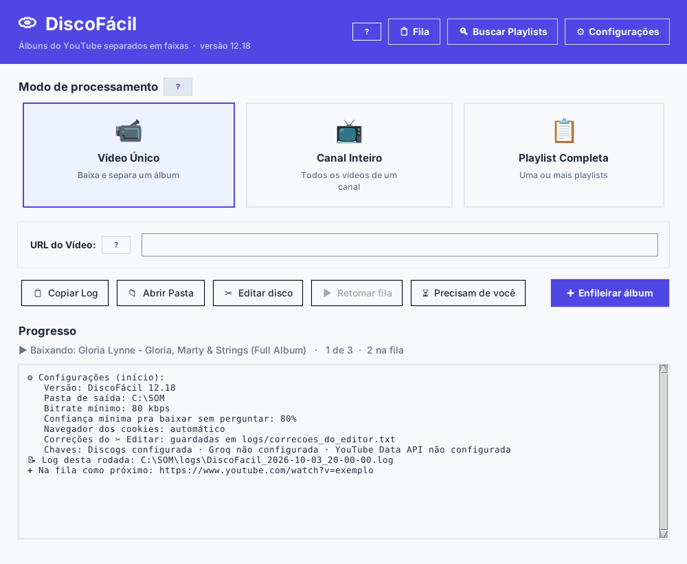
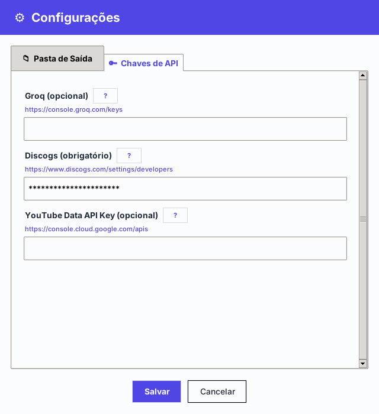
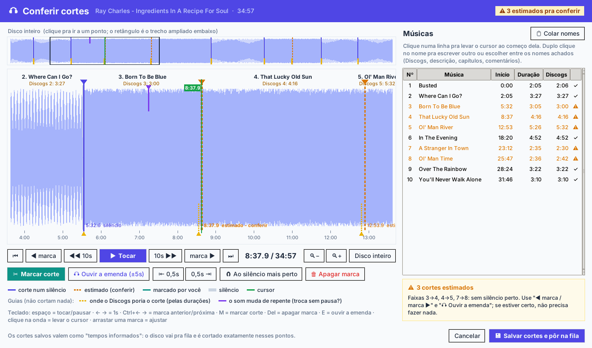
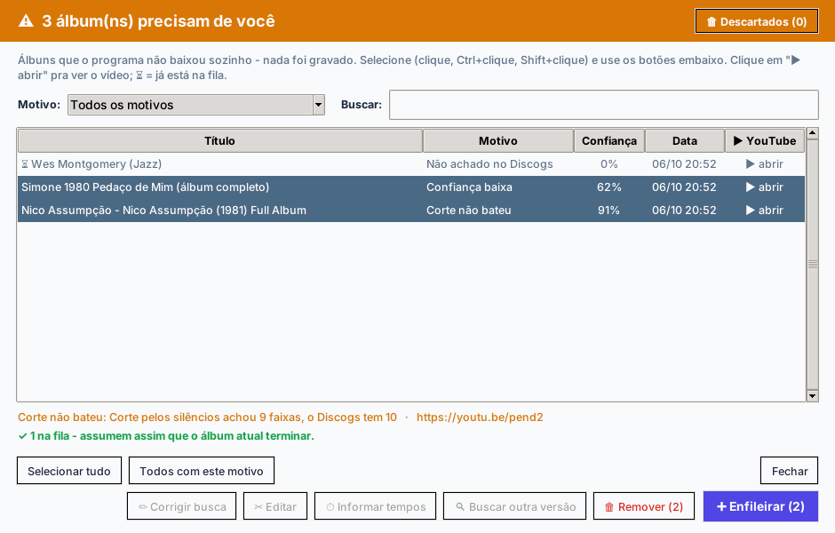
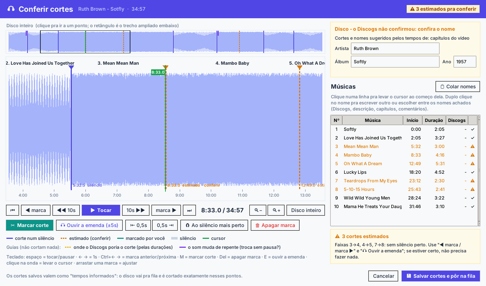

# 💿 DiscoFácil

Transforma vídeos de **disco inteiro do YouTube** ("Full Album") em **faixas MP3 separadas**, com o nome de cada música, o número, o artista, o álbum, o ano e a capa.

> **Por enquanto, só para Windows 64 bits** (Windows 10 ou 11).

**[⬇ Baixar](../../releases/latest)** · **[📘 Tutorial (PDF, com figuras)](Tutorial_DiscoFacil_12.18.pdf)** · **[🔑 Como conseguir as chaves](#como-conseguir-as-chaves)** · **[🖼 Telas](#telas)**

O programa descobre qual disco é pelo [Discogs](https://www.discogs.com), acha onde cada música começa (pelas pausas, pelas durações oficiais, pelos capítulos ou pelos tempos que alguém postou nos comentários) e grava cada uma num arquivo. Quando não tem certeza, **não grava nada errado**: o disco vai para a lista **"Precisam de você"**, onde você decide — e pode **ouvir o disco e acertar os cortes** numa tela própria.



## Baixar e usar

1. Vá em **[Releases](../../releases/latest)** e, em **Assets**, baixe o **`DiscoFacil_<versão>_Windows_64bits.zip`** (uns 170 MB). Os dois "Source code" que o GitHub põe embaixo são só o código, sem o programa.
2. Descompacte numa pasta e abra o **`DiscoFacil.exe`**. Não precisa instalar Python nem FFmpeg.
3. Na primeira vez, abra **Configurações** e:
   - escolha a pasta onde os discos serão gravados;
   - cole a sua **chave do Discogs** ([como conseguir](#discogs-obrigatória)). Cada pessoa usa a sua.
4. Cole o link do vídeo e clique em **Enfileirar**.

O **[tutorial](Tutorial_DiscoFacil_12.18.pdf)** (também dentro do zip) explica cada tela, passo a passo, com figuras.

**Para experimentar**: dois canais com muitos discos completos, bons para testar (modo **Canal Inteiro**, ou um vídeo de cada vez):
- [MultiWoking](https://www.youtube.com/@MultiWoking)
- [Discos Redondos (Full Albums)](https://www.youtube.com/@discosredondosfullalbum)

> **"O Windows protegeu o computador"**: o .exe não tem assinatura digital paga, então o Windows desconfia. Clique em **Mais informações → Executar assim mesmo**. Alguns antivírus também reclamam de programas gerados com PyInstaller; o código está todo aqui para quem quiser conferir.

## Como conseguir as chaves

Uma "chave" é uma senha que o site dá de graça para programas como este consultarem o catálogo. Elas ficam só no seu computador (no `config.json`, na pasta do programa) e nunca aparecem no log.

### Discogs (obrigatória)

É dela que vêm os nomes das músicas, o artista, o ano e a capa.

1. Crie uma conta grátis em [discogs.com](https://www.discogs.com) (ou entre na sua).
2. Abra **[Settings → Developers](https://www.discogs.com/settings/developers)**.
3. Clique em **Generate new token** e copie o código que aparece.
4. No DiscoFácil: **Configurações → Chaves de API → Discogs**, cole e **Salvar**.

### YouTube Data API (opcional)

Só serve para o botão **Buscar Playlists** e para listar mais rápido os vídeos de um **Canal Inteiro**. Sem ela o resto funciona normalmente. É grátis (o Google dá uma cota diária que sobra para esse uso).

1. Entre no **[Google Cloud Console](https://console.cloud.google.com/)** com a sua conta Google e crie um projeto (o nome tanto faz, ex.: "DiscoFacil").
2. Ative a **[YouTube Data API v3](https://console.cloud.google.com/apis/library/youtube.googleapis.com)** nesse projeto (botão **Ativar**).
3. Vá em **[APIs e serviços → Credenciais](https://console.cloud.google.com/apis/credentials)** → **Criar credenciais → Chave de API** e copie a chave.
4. (Recomendado) Na chave criada, em **Restrições de API**, deixe só a *YouTube Data API v3*.
5. No DiscoFácil: **Configurações → Chaves de API → YouTube Data API**, cole e **Salvar**.

Guias oficiais do Google: [YouTube Data API — primeiros passos](https://developers.google.com/youtube/v3/getting-started) (atualizado em setembro de 2026) e [Configurar chaves de API](https://support.google.com/googleapi/answer/6158862?hl=pt-BR).

### Groq (opcional)

Inteligência artificial que dá palpites quando o título do vídeo é confuso. O Discogs sempre confere o palpite. Crie a chave em **[console.groq.com/keys](https://console.groq.com/keys)** (**Create API Key**) e cole em **Configurações → Chaves de API → Groq**.



## Telas

**✂ Conferir cortes** — ouvir o disco inteiro, ver a onda, as pausas e as guias (amarelo: onde o Discogs poria cada corte; roxo: onde o som muda de repente), mover, marcar e apagar cortes e trocar nomes:



**Precisam de você** — os discos que o programa não quis decidir sozinho; nada foi gravado errado:



**Disco que o Discogs não confirmou** — o palpite não entra; artista, álbum e ano vêm do título do vídeo, para você conferir; cortes e nomes vêm dos capítulos do vídeo:



## O que ele faz

- **Vídeo único, canal inteiro ou playlist** (um disco em que cada vídeo é uma música).
- **Identificação pelo Discogs**, com nota de confiança; abaixo do mínimo configurado, pergunta antes.
- **Corte nas pausas reais**, conferido com as durações oficiais; músicas emendadas sem pausa são separadas pela duração e marcadas "a conferir".
- **✂ Conferir cortes**: a tela acima. Serve também para **corrigir discos já cortados** (botão **✂ Editar disco**).
- **Não baixa de novo** o que já está na pasta (pelo número do disco no Discogs).
- **Fila guardada**: pode fechar no meio e continuar depois.
- Tags ID3 completas e capa dentro de cada MP3.

## Aviso legal

O DiscoFácil é para **uso pessoal**. Ele não vem com música nenhuma: baixa o que **você** escolher, e baixar conteúdo do YouTube pode ir contra os termos de uso do YouTube e contra os direitos autorais de quem gravou o disco. **A responsabilidade pelo uso é de quem usa.** Prefira discos que você já tem, que estão em domínio público ou cujo dono permite a cópia.

## Para quem programa

Python 3.12 + Tkinter. O programa é feito e testado para Windows 64 bits; os testes também rodam no Linux. Para rodar a partir do código:

```
pip install -r requirements.txt
python main.py
```

Precisa do `ffmpeg` e do `ffprobe` no PATH (o .exe já vem com eles).

- **Como funciona por dentro:** [ARQUITETURA.md](ARQUITETURA.md) (o caminho de um disco, os módulos e onde mexer).
- **O que mudou em cada versão:** [MUDANCAS.md](MUDANCAS.md). **Planos:** [PLANO.md](PLANO.md).
- **Testes:** `python testes/rodar_todos.py` (precisa de `ffmpeg`; no Linux, de `xvfb-run` para as telas). Nenhum teste usa a internet. Ver [testes/LEIA.md](testes/LEIA.md).
- **Gerar o .exe:** `build_exe.bat` no Windows, ou automático aqui no GitHub: ao publicar uma versão em Releases (*Draft a new release*, tag `v12.19`), o GitHub gera o .exe e o anexa à versão ([.github/workflows/release.yml](.github/workflows/release.yml)).
- **As figuras** deste README e do tutorial saem de `testes/gerar_tutorial.py` (telas de verdade, com dados de exemplo).

## Licença

[GPL-3.0](LICENSE). Você pode usar, estudar, modificar e redistribuir, desde que as versões modificadas continuem abertas sob a mesma licença. As bibliotecas e programas usados, com as licenças de cada um, estão em [TERCEIROS.md](TERCEIROS.md).

Elaborado por Glauco — Barra do Piraí, RJ.
